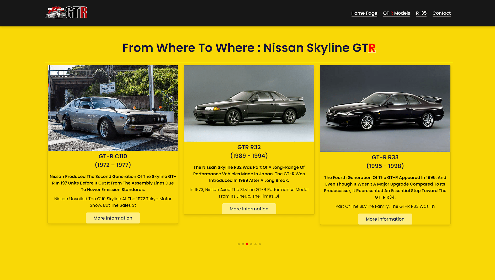

# Manageable Car Blog Web Project with Admin Panel with NodeJS | MySQL, Express JS


I designed a web project promoting my favorite car model, the Nissan GTR. You can manage the site from the Admin Panel

I developed using Node JS (with Express) as the Backend in the Web Project.

I used MySQL as database.

I designed the Login Panel and User Panel using my own knowledge. I got the Admin Panel ready from [BootstrapDash](https://www.bootstrapdash.com/product/og-star-admin-free) and customized it

## Deploy
https://car-blog-nodejs-production.up.railway.app/


## To Run the Project

- Include Your Database in Server (`project-db.sql`)
- Ensure the necessary packages are installed by saying `npm install`

- Create (`.env`) in ('./') path

```
DB_HOST = localhost
DB_USER = root
DB_PASS = 
DB_NAME = gtr-web
DB_PORT = 
EMAIL_USERNAME = 
EMAIL_FROM = 
EMAIL_PASS = 
```

- You can run the project by saying `npm run dev` 

- `/admin` at the end of the url to access the admin panel 

```
email = guest@guest.com
password = 123
```


### package.json

```
{
  "name": "gtr-web",
  "version": "1.0.0",
  "description": "",
  "main": "index.js",
  "scripts": {
    "test": "echo \"Error: no test specified\" && exit 1",
    "dev": "npx nodemon src/index.js",
    "start": "node src/index.js"
  },
  "keywords": [],
  "author": "",
  "license": "ISC",
  "dependencies": {
    "bcrypt": "^5.1.0",
    "cookie-parser": "^1.4.6",
    "dotenv": "^16.3.2",
    "ejs": "^3.1.8",
    "express": "^4.18.1",
    "express-mysql-session": "^2.1.8",
    "express-session": "^1.17.3",
    "htmlspecialchars": "^1.0.5",
    "multer": "^1.4.5-lts.1",
    "mysql2": "^3.6.1",
    "nodemailer": "^6.9.1",
    "nodemon": "^2.0.20",
    "tiny-csrf": "^1.1.3"
  }
}
```

## Features

#### Features in the Admin Panel
- Powerful Backend Built with Express Framework

- The project was designed with MVC (Model View Controller) structure

- One To One Relationships method was used in some of our tables in the database.
    - Listed data in "R35 Models" section by users

- I have secured the Authentication & Authorization features with JSON (JWT).

- Authorization by Roles and Users

    - Roles such as Admin, Moderator and Editor have been authorized in the Admin Panel.
    - Delete Users Edit Add operation assigned to administrator with Admin role
    - Users can be assigned permissions
- With CSRF (Cross Site Request Forgery), the security of the information coming from the forms has been ensured.

    - Real or fake users are distinguished with CSRF (Cross Site Request Forgery).

- Unauthorized access in the Admin Panel has been disabled.

- SQL queries were made to prevent SQL Injection Vulnerabilities

- Users Passwords are encrypted with MD5 format

- With Session, the data of the necessary warnings were shown to the users (req.session)

- Admin Panel created with CRUD (Create, Read, Update, Delete) method
- Deleting old photos in editing and deleting sections with photo feature
- Used CKEditor 5 HTML Editor
- Display requested data on User Page with Active Passive feature
- Users can fill in the Contact form on the User page and contact the site administrators.

#### History Section


#### History Section

#### İnbox Section


#### İnbox Section


### Profile Editing and Password Page by Login User


#### Features in the Login Panel

- Users passwords are encrypted with MD5 Format.
- Logging in with MD5 Format
- Registration Page
  - Check for double typing of new password on Registration Page
- Users Can Change Passwords With Forgot Password Feature.
  - "Forgot Password" security is secured with JWT (token).
  - Using "nodemailer" package for users to change their passwords, a link has been sent to their related e-mails
  - The related tokens of users using "Forgot Password" were stored in the database and control was provided in the password change process. In this feature, users' data security is ensured.
- Fixed SQL Injection Vulnerability in All Features of Login Panel
- In all forms in the Login Panel - Real and fake users are distinguished with csrf Token
- User can log out and log out from admin panel

#### Login Page

#### Register

#### Reset Password

#### New Password


#### Features in the User Panel

- Design Designed for Users
- Detail Page has been created to show detailed information in "History Section" and "R35 Models" Section
- Users can send messages with Site Administrators in the Communication Section



#### Detail History Section 

#### R35 Models Section

#### Detail R35 Models Section 


Happy Coding